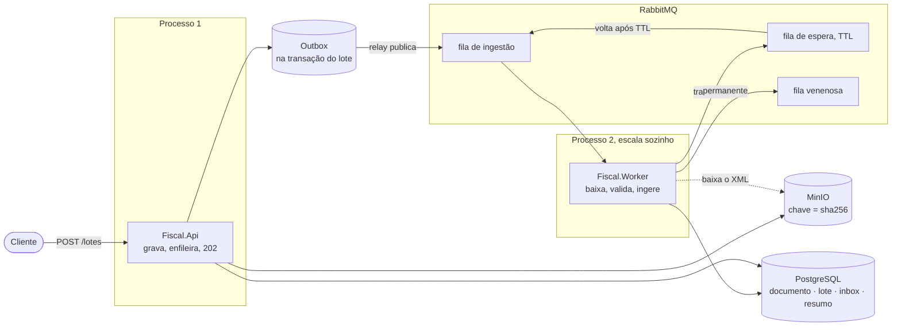
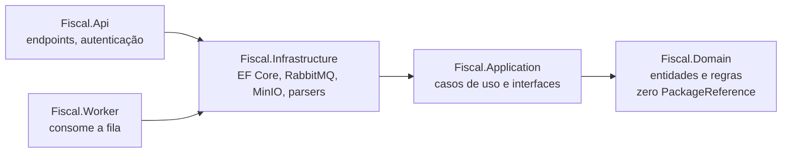

# API de documentos fiscais

Recebe lotes de XML de NF-e, grava os arquivos, ingere de forma assíncrona e deixa
quem enviou acompanhar o andamento. Expõe consulta, alteração e exclusão sobre os
documentos ingeridos.

**Dois deployáveis:** `Fiscal.Api` serve HTTP e aceita os lotes; `Fiscal.Worker`
consome a fila e faz a ingestão.

.NET 10 · PostgreSQL 17 · RabbitMQ 4 · MinIO · EF Core 10 · NUnit + Testcontainers · k6

---

## Rodando

Há dois caminhos. Os dois deixam a API em `http://localhost:5099`.

### Tudo em container — só precisa de Docker

```bash
docker compose --profile completo up -d
```

Compila API e worker, sobe PostgreSQL, RabbitMQ e MinIO, espera os três ficarem
saudáveis e então inicia os dois processos. **Não exige o SDK do .NET instalado.**

O MinIO é local: roda no seu Docker, sem conta e sem chamada para fora. A biblioteca
cliente fala o protocolo do S3 apenas porque isso torna a troca por S3, R2 ou Spaces
uma questão de configuração.

Para ver o consumo escalando sem tocar na API:

```bash
docker compose --profile completo up -d --scale worker=3
```

### Local — para depurar

```bash
docker compose up -d
dotnet run --project src/Fiscal.Api
dotnet run --project src/Fiscal.Worker
```

Exige o **SDK do .NET 10**, e são dois terminais. Rodar só a API funciona: os lotes
são aceitos e ficam pendentes até um worker subir.

### Em qualquer um dos dois

| Recurso | Onde |
|---|---|
| Documentação interativa | `/scalar/v1` |
| OpenAPI | `/openapi/v1.json` |
| Saúde | `/health` |
| Painel do RabbitMQ | `http://localhost:15672` — `fiscal` / `fiscal` |
| Console do MinIO | `http://localhost:9001` — `fiscal` / `fiscal123` |
| Log do worker | `docker compose logs -f worker` |

**Quem aplica as migrations é a API**, no start; o worker espera o schema ficar
pronto. Na primeira execução o log mostra um `fail` do EF Core consultando
`__EFMigrationsHistory` — é esperado, a tabela ainda não existe numa base nova.

Para derrubar tudo, incluindo os dados: `docker compose --profile completo down -v`.

### Autenticação

Todas as rotas (exceto `/health`, `/openapi` e `/scalar`) exigem dois cabeçalhos:

```
X-Api-Key: chave-de-desenvolvimento
X-Cnpj: 12345678000199
```

---

## Endpoints

### `POST /lotes` — envia de 1 a 100 XMLs

`multipart/form-data`. A resposta é **`202 Accepted`**: os arquivos foram gravados e
enfileirados, e nada foi processado ainda.

```bash
curl -X POST http://localhost:5099/lotes \
  -H "X-Api-Key: chave-de-desenvolvimento" \
  -H "X-Cnpj: 12345678000199" \
  -F "arquivos=@exemplos/nfe-exemplo.xml"
```

```json
{ "loteId": "01a06fbc-ced2-73d9-bb39-ea9e5061f6d6", "quantidadeDeArquivos": 1 }
```

| Situação | Resposta |
|---|---|
| Lote aceito | `202` + `Location: /lotes/{id}` |
| Nenhum arquivo, ou multipart malformado | `400` |
| Mais de 100 arquivos | `400` |
| Algum arquivo acima de 10 MB | `413` |

### `GET /lotes/{id}` — acompanhamento

```json
{
  "id": "01a06fbc-ced2-73d9-bb39-ea9e5061f6d6",
  "situacao": "ConcluidoComErros",
  "total": 4, "pendentes": 0, "ingeridos": 3, "duplicados": 0, "rejeitados": 1,
  "itens": [
    { "nomeArquivo": "lixo.xml", "situacao": "Rejeitado",
      "motivo": "XML inválido: Data at the root level is invalid.", "documentoId": null },
    { "nomeArquivo": "nfe-1.xml", "situacao": "Ingerido",
      "motivo": null, "documentoId": "01a06fbc-d0aa-7c53-b0f5-1e0f0f9b4a21" }
  ]
}
```

**Situação do lote:** `Recebido` → `Processando` → `Concluido` | `ConcluidoComErros`.
Ela é sempre **derivada** dos itens, nunca afirmada de fora.

**Situação do item:** `Pendente` → `Ingerido` | `Duplicado` | `Rejeitado`.
Duplicado não é erro — o mesmo XML já havia sido ingerido, e o lote conclui limpo.

`GET /lotes` lista os lotes recentes do contribuinte autenticado.

### `GET /documentos` — listagem

```bash
curl "http://localhost:5099/documentos?dataInicio=2026-01-01T00:00:00Z&documentoDestinatario=52998224725&uf=SP&pagina=1&tamanho=20" \
  -H "X-Api-Key: chave-de-desenvolvimento" -H "X-Cnpj: 12345678000199"
```

```json
{
  "itens": [{
    "id": "01a06fbc-d0aa-7c53-b0f5-1e0f0f9b4a21",
    "chaveAcesso": "35260112345678000199550010000000011123456780",
    "cnpjEmitente": "12345678000199", "ufEmitente": "SP",
    "documentoDestinatario": "***982247**",
    "nomeDestinatario": "Maria ********* ** *****",
    "dataEmissao": "2026-01-15T13:30:00+00:00", "valorTotal": 300.00, "observacao": null
  }],
  "pagina": 1, "tamanho": 20, "total": 1, "totalPaginas": 1
}
```

Filtros: `dataInicio`, `dataFim`, `documentoDestinatario`, `uf`, `pagina`, `tamanho`
(padrão 20, teto 100).

**Não existe filtro por CNPJ do emitente** — ele já está fixado pela autenticação, e
o parâmetro seria inócuo. O filtro por CNPJ que produz resultado é o do destinatário.

### `GET /documentos/{id}` · `PUT` · `DELETE`

| | |
|---|---|
| `GET` | detalhe com itens e CPF/CNPJ **íntegro**; devolve `ETag` para `304` |
| `PUT` | altera **apenas** a observação — ver [imutabilidade](#1-o-documento-fiscal-é-imutável) |
| `DELETE` | exclusão lógica, `204`; repetir é no-op |

| Situação | Resposta |
|---|---|
| Não existe, **ou é de outro CNPJ** | `404` |
| Excluído logicamente | `410` |

### `GET /resumos`

Agregado por emitente e competência, alimentado pela ingestão.

---

## Desenho

### Em execução



A linha síncrona é curta de propósito: hash, gravação e registro. Nada de parse no
caminho da resposta.

### Dependências entre camadas



Cinco testes de arquitetura falham se alguma dessas setas se inverter, ou se EF Core
e `RabbitMQ.Client` vazarem para fora da infraestrutura.

```
src/
  Fiscal.Domain/          documento fiscal, lote, inbox, outbox, resumo
  Fiscal.Application/     casos de uso e as interfaces que eles exigem
  Fiscal.Infrastructure/  EF Core, repositórios, parsers, RabbitMQ, MinIO
  Fiscal.Api/             deployável 1: HTTP
  Fiscal.Worker/          deployável 2: consumo da fila
tests/
  Fiscal.UnitTests/         47 testes, sem dependência externa
  Fiscal.IntegrationTests/  23 testes, PostgreSQL e MinIO reais via Testcontainers
  Fiscal.ArchitectureTests/ 5 regras de direção de dependência
carga/                      script k6 e resultados medidos
```

---

## Decisões de arquitetura e modelagem

### 1. O documento fiscal é imutável

O enunciado pede "atualizar um documento existente". Documento fiscal autorizado
**não se altera**: corrige-se por carta de correção ou cancela-se, e ambos geram
outro XML.

O documento — chave, emitente, destinatário, valores, itens — não tem um único setter
público; o único método de mutação é `AtualizarObservacao`. A observação é anotação
interna de quem recebeu, nasce do nosso processo e não do Fisco.

**A restrição é estrutural, não convencional: não existe caminho no código para
sobrescrever o documento.** Um teste por reflexão falha se alguém abrir um setter.

Pela mesma razão, `DELETE` é exclusão lógica: o Fisco exige guarda de cinco anos.

### 2. Ingestão assíncrona em lote

O `POST` faz o mínimo: calcula o hash, grava o arquivo, registra a intenção de
processar, responde `202`. Parse, validação e persistência são do worker.

Três consequências, todas desejadas:

- **uma rajada de ingestão não degrada quem está consultando** — o trabalho pesado
  não compete pela thread da requisição;
- **o worker faz trabalho de verdade.** Num desenho anterior ele mantinha um agregado
  que um `GROUP BY` calcularia; agora ele parseia, valida e decide estado;
- **o cliente ganha uma pergunta respondível.** Ingestão assíncrona cria o problema
  "o que aconteceu com o que eu mandei", e `GET /lotes/{id}` é a resposta.

**Uma mensagem por arquivo, não por lote.** Um XML corrompido não pode envenenar os
outros 99, e cada arquivo tem retry e dead-letter próprios.

### 3. Idempotência em quatro níveis

| Nível | Mecanismo |
|---|---|
| Armazenamento | a chave do objeto é o SHA-256 do conteúdo — regravar escreve o mesmo objeto |
| Documento | índice único `(Tipo, ChaveAcesso)` |
| Mensagem | inbox: `(MensagemId, Consumidor)` único, gravado na transação do efeito |
| Publicação | outbox: a intenção nasce na transação do lote |

Nenhum deles é uma verificação prévia. **Em todos, quem decide é uma restrição do
banco falhando** — entre consultar e gravar há uma janela em que dois processos
concorrentes passam na verificação e ambos gravam.

Detalhe deliberado: **o índice único do documento não filtra exclusão lógica.** Se
filtrasse, reenviar o XML de um documento excluído criaria uma segunda linha para o
mesmo documento fiscal.

E um detalhe que só aparece quando tudo isso vira uma transação: no PostgreSQL,
**qualquer erro deixa a transação abortada**. Como a idempotência é construída
deixando o índice único falhar de propósito, sem `SAVEPOINT` a primeira violação
derrubaria a transação inteira da ingestão. `Escrita.TentarAsync` isola cada tentativa.

### 4. Outbox para não perder o que foi aceito

Gravar no storage e publicar na fila não compartilham transação. Se a API caísse
entre as duas, o item ficaria pendente para sempre e o cliente veria um lote que
nunca termina.

A intenção de publicar é gravada na **mesma transação** do lote, e um relay publica
depois. O commit passa a ser o único ponto de decisão: ou tudo existe, ou nada existe.

O relay usa `FOR UPDATE SKIP LOCKED`, então várias réplicas da API varrem a mesma
tabela sem duplicar trabalho nem esperar umas pelas outras. Publicar e marcar como
publicado não são atômicos entre broker e banco — aceito de propósito: a entrega é
at-least-once por natureza e o inbox do worker existe para isso. **Perder mensagem
seria grave; duplicar não é.**

### 5. Isolamento no `DbContext`, não no endpoint

O filtro por CNPJ é um Global Query Filter: toda consulta escrita daqui pra frente já
nasce isolada. Isolamento aplicado no endpoint vale até alguém esquecer.

Os filtros são **nomeados** (`ExclusaoLogica`, `IsolamentoPorCnpj`) para que desligar
um seja escolha localizável — um `IgnoreQueryFilters()` sem argumento derrubaria os
dois.

Ler o CNPJ sem estar autenticado **lança exceção**. O worker, que é cross-tenant por
natureza, abre um escopo de sistema explícito, e cada abertura vira log — é o rastro
de auditoria do acesso cross-tenant.

Documento ou lote de outro CNPJ responde `404`, não `403`: um `403` confirmaria a
existência.

### 6. PostgreSQL relacional; o XML no armazenamento de objetos

Relacional, sem MongoDB. O que a API consulta são metadados fiscais com filtros
compostos e ordenação — território de índice composto e restrição única. A restrição
única, aliás, não é detalhe de storage aqui: **é o mecanismo de idempotência**.

O XML original vai para armazenamento de objetos, não para o banco. Isso preserva o
que mais importa: **a assinatura digital da NF-e é calculada sobre o XML
canonicalizado e não pode ser reconstruída a partir dos campos parseados.** Sem o
arquivo não haveria como provar autenticidade nem reprocessar os campos que este
parser não extrai.

Blob fora do banco mantém a tabela principal enxuta e permite trocar o provedor sem
tocar em schema.

### 7. Camadas com dependências verificadas

`Domain` → `Application` → `Infrastructure` → `Api`/`Worker`. O domínio não tem **um
único `PackageReference`**. EF Core, Npgsql, `RabbitMQ.Client` e o SDK do S3 existem
só na infraestrutura — é por isso que a composição mora numa extensão dentro dela.

Cinco regras de NetArchTest guardam isso, e **cada uma foi confirmada injetando uma
violação real e vendo o teste falhar**.

Sem MediatR e sem CQRS. Casos de uso são classes simples injetadas por construtor.
Interfaces existem nas travessias de camada; dentro da camada, tipo concreto.

### 8. Resiliência no consumo: dois níveis e uma distinção

| Situação | O que acontece |
|---|---|
| Falha transitória | Retry in-process, backoff exponencial com jitter, **teto de 10s** |
| Persiste após o teto | Fila de espera com TTL, que devolve à principal |
| Erro permanente (XML inválido) | O item é **rejeitado com motivo** e a mensagem é confirmada |
| Tentativas esgotadas (`x-death` ≥ 3) | Fila venenosa |

A distinção entre transitório e permanente é o ponto. Um XML malformado não vira
válido na décima tentativa — ele vira um item `Rejeitado` no lote, que é informação
útil para quem enviou, em vez de uma mensagem circulando na fila.

**O teto de 10s veio de uma medição.** Sem ele, cada tentativa de conexão do Npgsql a
um banco fora do ar espera 15s: três tentativas seguravam o consumidor por cerca de
60s numa única mensagem, e com prefetch 10 as outras nove ficavam presas atrás dela.
Com o teto: 12s.

### 9. Dois deployáveis

`Fiscal.Api` publica; `Fiscal.Worker` consome. Enquanto o consumidor era hospedado
dentro do processo web, três coisas ficavam acopladas sem que ninguém escolhesse:
escalar a API multiplicava consumidores, um deploy rolling interrompia mensagem em
processamento, e os perfis de carga são diferentes.

**Nenhuma classe do consumidor precisou mudar** para separá-los: ele já recebia tudo
por interface. A separação custou meia hora porque a mensageria estava atrás de
abstração.

Só a API aplica migrations, porque é dona do schema; o worker espera. Isso também foi
aprendido rodando: com os dois migrando contra um banco vazio, um morre com
`relation already exists` — o lock de migração do EF não cobre a corrida quando nem a
tabela de histórico existe ainda.

---

## Segurança e dados sensíveis

### XXE e ataques via XML

Existe **uma única** configuração de leitura de XML no projeto — não há
`XmlReader.Create` solto — e ela fecha as três famílias clássicas:

| Ataque | Defesa |
|---|---|
| **XXE** — entidade externa lendo arquivo local ou batendo em URL interna | `DtdProcessing.Prohibit`, sem resolver |
| **Billion laughs** — entidades recursivas expandindo para gigabytes | mesmo `Prohibit` + `MaxCharactersFromEntities = 0` |
| **Documento gigante** | teto de caracteres, mais 10 MB por arquivo e 50 MB por lote |

No fluxo em lote, o ataque recusado vira um item `Rejeitado` com o motivo visível —
não uma exceção que sobe, não um `500`, e não uma mensagem retentada.

### Dado pessoal

Uma NF-e carrega CPF, nome e endereço do destinatário.

- **Mascarado na listagem, íntegro no detalhe.** Exposição em massa é o risco;
  consulta individual autorizada é uso legítimo. O mascaramento acontece no caso de
  uso, não no endpoint, para que nenhum consumidor da listagem — inclusive um log —
  veja o valor em claro.
- **Todo acesso ao detalhe com destinatário preenchido é registrado em log**, com o
  CNPJ do solicitante mascarado.
- **Nada de dado pessoal em log de erro.** Erro não tratado vira `ProblemDetails`
  genérico, sem stack trace nem caminho de arquivos.
- **Isolamento por contribuinte** aplicado no modelo (decisão 5).

### LGPD × obrigação fiscal

Estes dados **não** estão sob consentimento: a base legal é obrigação legal. O
direito de eliminação do titular não se aplica enquanto durar o prazo de guarda de
cinco anos — e é por isso que a exclusão é lógica, não física.

### Autenticação

Deliberadamente simples: cabeçalho `X-Cnpj` mais `X-Api-Key` conferida em **tempo
constante** (comparar segredo com `==` vaza informação pelo tempo de resposta).

Em produção seria um JWT com o CNPJ numa claim. A escolha é consciente: o que está
sendo demonstrado é o **isolamento**, que vive no filtro global do `DbContext` e não
muda com a troca do mecanismo de autenticação.

---

## Testes

```bash
dotnet test
dotnet test tests/Fiscal.UnitTests
dotnet test tests/Fiscal.ArchitectureTests
dotnet test tests/Fiscal.IntegrationTests
```

**75 testes** — 47 unitários, 23 de integração e 5 de arquitetura. Os unitários e os
de arquitetura não precisam de nada; os de integração sobem PostgreSQL e MinIO reais
via Testcontainers e **exigem Docker**: índice único, filtro global, exclusão lógica
e savepoint dentro de transação só existem na infraestrutura de verdade.

Os que carregam mais peso:

| Teste | O que garante |
|---|---|
| `Reprocessar_a_mesma_mensagem_nao_conta_o_documento_duas_vezes` | Inbox sob reentrega |
| `Xml_invalido_rejeita_o_item_e_o_lote_conclui_com_erros` | Um arquivo ruim não contamina os outros |
| `Mesmo_arquivo_em_dois_lotes_grava_um_documento_e_marca_o_segundo_como_duplicado` | Idempotência entre lotes |
| `Nenhuma_propriedade_do_documento_tem_setter_publico` | Imutabilidade, por reflexão |
| `Excluir_esconde_da_listagem_mas_a_chave_continua_ocupada` | Índice único ignora exclusão lógica |
| `Seleciona_um_layout_novo_apenas_por_registro_no_container` | Extensibilidade sem tocar no pipeline |
| `Consultar_documento_de_outro_contribuinte_devolve_404_e_nao_403` | Isolamento sem vazar existência |

O fluxo de mensageria foi verificado manualmente contra broker real: mensagem
ilegível indo para a fila venenosa sem tentativas, e mensagem válida publicada com o
banco parado indo para a fila de espera, voltando após o TTL e sendo processada.

### Carga

Números e método em [`carga/RESULTADOS.md`](carga/RESULTADOS.md).

**Não há cache de aplicação, e o número é o argumento.** No volume medido a consulta
responde em torno de 20 ms de média — não existe gargalo para cachear. Cache exige
invalidação, e invalidação errada devolve dado velho. O que existe no lugar, a custo
zero, é o **ETag** reaproveitando o SHA-256 já calculado.

---

## Se tivesse mais tempo

**Container de migração dedicado.** Hoje a API aplica as migrations no start e o
worker espera. O desenho correto é um passo de deploy separado, com os dois serviços
dependendo da conclusão dele — migração não deveria estar no caminho de subida de uma
aplicação.

**Paginação por keyset.** `OFFSET` degrada linearmente com a profundidade: a página
5.000 lê e descarta 100 mil linhas. Paginar por `(DataEmissao, Id)` mantém o custo
constante. Junto com isso, deixar de contar: o `COUNT(*)` é uma segunda ida ao banco
de custo próximo ao da página.

**Reprocessamento a partir do storage.** O XML está guardado, então dá para
reprocessar um item rejeitado depois de corrigir o parser. Falta o endpoint e a
transição de estado que permitem isso.

**Verificação da assinatura digital.** O arquivo está lá; validar a assinatura contra
a cadeia da ICP-Brasil é o passo que transformaria "recebi um XML" em "recebi um
documento autêntico".

**CT-e e NFS-e de verdade.** A costura está pronta e testada; falta escrever os
parsers. NFS-e é o caso difícil, com layout variando por município.

**Limpeza de órfãos no storage.** Se a transação do lote falhar depois da gravação, o
objeto fica sem dono. É inofensivo — a chave é o hash, o reenvio reaproveita — mas
ocupa espaço para sempre.

**JWT e autorização por papel.** Hoje qualquer chave válida faz tudo dentro do seu CNPJ.

**Observabilidade.** Logs estruturados existem, mas faltam métricas e tracing
distribuído — sem eles, diagnosticar uma mensagem presa na fila em produção é
arqueologia.

**Segredos fora do compose.** Chave de API e senhas estão em texto no
`docker-compose.yml`, o que serve para um ambiente de avaliação e nada além disso.
